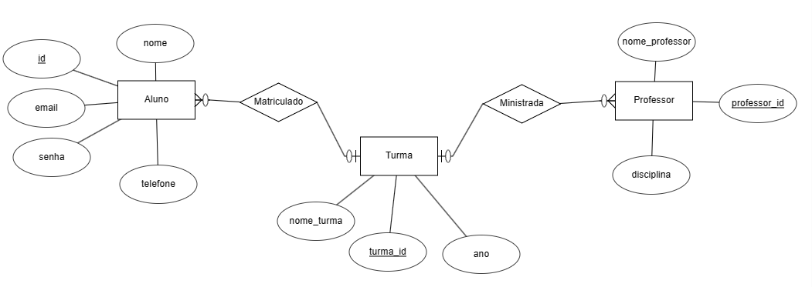

<h1 align="center">Educa.Net Sites - ICS</h1>
<h3 align="center">xxxxxxxxxxxxxxxxxxxx</h3>

<h3 align="left">Projeto ICS</h3>
<a href="ifrn-siteics.com"><li align="left">Site Front-End ( ifrn-siteics.com) </li></a>
<a href="ifrn-siteicsadm.com"><li align="left">Site Back-End ( ifrn-siteicsADM.com) </li></a>

<h3 align="left">Vídeos do Projeto</h3>
<a href="https://youtu.be/D5uix-cZLFg?si=xLRzfe37epE7vVAU"><li align="left">Acesso aos 2 sites</li></a>
<a href="https://youtu.be/nAug9N0cExA?si=97NdQvThsOKnTFtY"><li align="left">Utilização Completa da Aplicação</li></a>

  <h3>Diagrama ER</h3>

<h3 align="left">Tecnologias Utilizadas:</h3>

       

